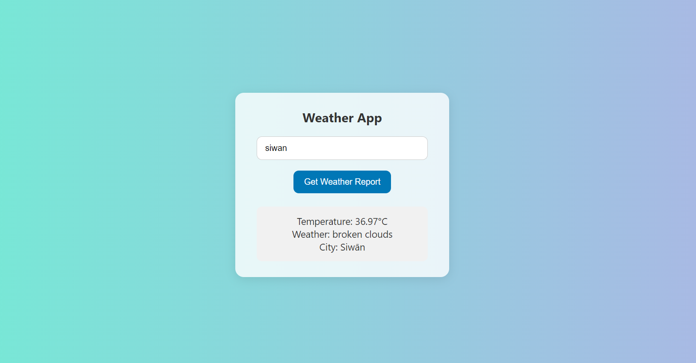

# 🌤️ Weather App

A simple React application to fetch and display current weather information for a city using the OpenWeatherMap API.

## 🔧 Features

- Enter a city name and get the current weather
- Displays temperature, weather description, and city name
- Uses OpenWeatherMap API
- Built with React and fetch API

## 🚀 Demo

[Optional: Add a link to your live site if hosted on Netlify, Vercel, or GitHub Pages]

## 🖥️ Screenshot

![Weather App Screenshot] 

## 📦 Installation

1. **Clone the repo:**
   ```bash
   git clone https://github.com/your-username/weather-app.git
   cd weather-app
    npm install
    npm start

🔑 API Key
This app uses the OpenWeatherMap API.
    You need to sign up at openweathermap.org and get your free API key.
    Replace the placeholder API key in App.js:

    const response = await fetch(
  `https://api.openweathermap.org/data/2.5/weather?q=${cityName}&appid=YOUR_API_KEY&units=metric`
);

📁 Project Structure
    weather-app/
├── public/
│   └── index.html
├── src/
│   ├── App.js
│   ├── App.css
│   └── index.js
├── package.json
└── README.md

🧑‍💻 Built With
React

JavaScript (Fetch API)

OpenWeatherMap API